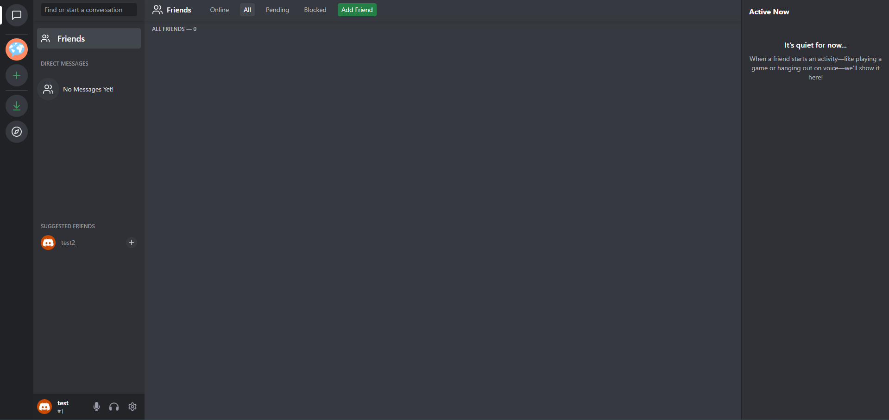
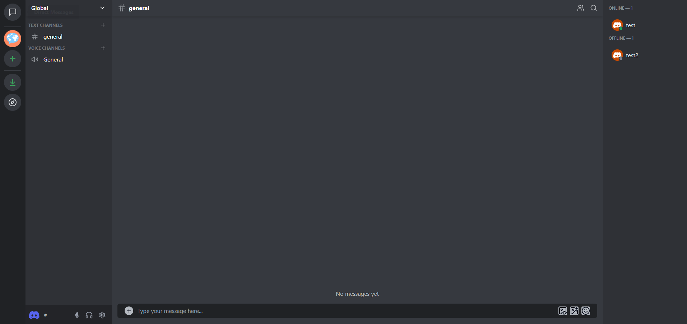
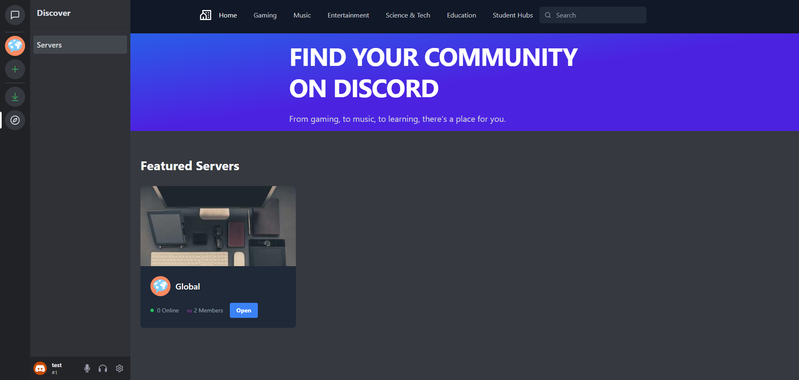
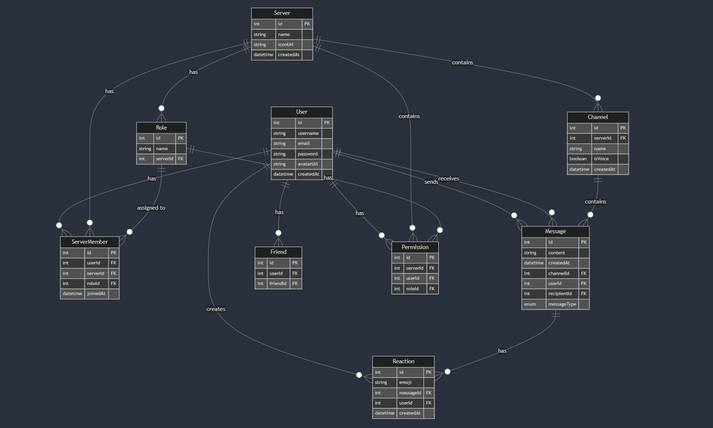

# Discord-2
Live Demo: [Discord-2](https://discord-2.vercel.app/)

A full-stack application inspired by Discord, designed for real-time messaging, server management, and user interactions. This project includes features like voice and video chat, private and server-based messaging, and mobile-friendly designs.




## Features
Core Functionalities:
- Messaging
    - Real-time messaging using WebSockets.
    - Real-time Typing indicators
    - Message notifications
    - Read receipts
    - Embedded Server Invites
    - Support for text, images, videos, audio, and GIFs.
- Server Management:
    - Create, join, and manage servers with channels.
    - Role-based permissions and member lists.
- Voice and Video Chat:
    - Integrated voice and video calls with WebRTC.
    - Full-screen and picture-in-picture support.
- Friend System:
    - Add, accept, or decline friend requests.
    - Suggested friends feature.
- Gif Selector:
    - Select and share GIFs/sticker/emoji from Tenor with friends
- Mobile Optimization:
    - Mobile-friendly navigation and layouts for discovery, chat, and server pages.
- Error Handling and Logging:
    - Backend logging for debugging.
    - Error display on the UI for improved user experience.


## Tech Stack

Frontend:
- React
- Vite
- TypeScript
- Tailwind
- Socket.io
- WebRTC
- Axios
- Tenor Api

Backend:
- Node.js
- TypeScript
- Prisma
- PostgreSQL
- Express.js
- WebSocket (Real-time Messaging)
- WebRTC (Real-time video streaming)

Authentication: 
- Passport.js for User Authentication

Database:
- PostgreSQL
- Prisma ORM

Cloud Services:
- AWS S3 (File Storage)
- Netlify (Frontend Deployment)
- Railway (Backend Deployment)

Ads:
- Google Adsense

## Initial Database Schema



## Run Locally

Prerequisites:
- Node.js (v16 or later)
- PostgreSQL
- Git

Clone the project

```bash
  git clone https://github.com/AbdallaAlhag/Discord-2.git
  cd Discord-2
```

Go to the project directory

```bash
  cd Discord-2
```

Install dependencies

```bash
  npm install
```

Set up the environment variables:

```bash
  Backend:
  DATABASE_URL=<your-database-url>
  AWS_ACCESS_KEY=<your-aws-key>
  AWS_SECRET_KEY=<your-aws-secret>
  Frontend:
  Vite_API_BASE_URL=<your-localhost>
  VITE_TENOR_API_KEY=<your-tenor-key>
  CLIENT_KEY=<your-tenor-name>
```


Start the server and client

```bash
  npm run dev
```
## History:
---
- [ ] not done yet:
- [x] done: 
do this near the end:
- [x] fake data works well with front end, but remove it
- [x] reset database dev and prod
- [x] change id in prisma from autoincrement to uuid
- [x] update and remove mock users, try to make it more intuitive for people -> root group chat and suggest add friends?
---


- [x] create server active: 
    - [x] got hover to work 
    - [x] but not active
- [ ] Don't like how server channels on sidebar reload but its okay
- [x] invite sending and both are embedded but link embeds after refresh.
- [ ] change invite if already joined
    - [ ] invite code is pretty useless, don't know how to do anything with it.
    - [ ] work on expired or deleted servers for invites
    - [ ] fix: links embeds after refresh 

- [x] work on chat:
    - [x] make the chat look like discord: add time hover over message to show time
    - [x] server chat still little bugged but kinda annoying to fix 
        - [x] message don't send twice and update chat dates correctly
    - [x] fix chat date display if new day
- [x] register page background is pretty slow sometimes
---

- [x] Work on gif picker, make it a modal and work on opening and closing it. 
    - [x] make sure it works with messaging (.gifs work)
        - [x] make sure it works with other types
    - [x] try to get stickers working
- [x] Fix: voice channel is based on server channel text group not voice group
---

- [ ] work on server menu
    - [ ] create delete channel 
    - [x] create leave server
    - [x] create delete server
- [x] add menu permissions
---

- [ ] work  on real time issues: 
    - [ ] Adding friend is not real time but i think that's okay, we can fix it later, not a priority 
    - [x] Create channel is not real time, just needs a refresh
    to see it.
    - [x] Fix: server chat is not real time?
---

- [ ] pause execution on webrtc development at the moment!!!
    - [ ] fix slight bug in voice, user count is off and remote video doesn't work on first join. Prob needs a refresh?
    - [ ] Can't see other user's voice indicators like video, audio, and mic indicators -> add this to metadata?
    - [ ] fix not active on user screens and correct the amount of people in voice room, when clicking on server, should get users in voice channels -> idk lol 
    - [ ] create that green border hover when voice is activated
    - [ ] clicking other voice channels should make you leave the current one
    - [x] Get voiceChanneldisplay working properly
        - [x] get all buttons to work in serverchannelsidebar 
        - [x] voice display
    - [ ] pop out freezes
---

- [x] work on server channel online indicator, just showcase users in server
    - [x] haven't set online indicator up yet, but it should be simple
    - [x] friends nav
    - [x] direct messages 
    - [x] memberLists
- [x] Update tooltips for buttons 
    - [x] channel sidebar buttons
    - [x] private message sidebar buttons   
    - [x] channelwebrtc icons
    - [x] private server voice channel modal
    - [x] voiceChanneldisplay buttons
---
#### Priority:
- [x]  mobile mode (eh)
- [x]  typing real time indicator works
- [x]  real time read receipts -> private chat only tbh
    - [x] Add a ding on real time receipt to showcase, low priority
- [x]  Notifications from server or users on new message
    - [ ] fix notification count, should reset but some messages are never read
    - [ ] no notification if we are on message page -> have to turn private chat into a param page to detect, some are not real time
- [x]  users online status
- [x]  voice chat / video chat / screen share
    - [ ] rough draft working, come back later
- [x] deploy to production
- [x] work on front end private routes
- [x]  discover tab in server side -> maybe make all servers public or something like that
- [x] leave server 
    - [ ]  leave server is not real time? low priority _> send to home page
- [x] profile settings
- [x]  permissions and roles -> revamped and set up roles for server menu
- [x] mobile friendly
    - [x] update tenor gif picker for mobile
- [x] fix modals not properly displaying -> using react portals to render the a child component into a DOM node that exist outside the DOM hierarchy of the parent components
- [ ] clicking outside logout modal should close it (attempted to fix but made situation worse)
- [x] accept files and images/vids/gifs ? maybe add a file uploader? lol -> aws s3, able to upload and delete files
    - [x] upload server img
    - [x] upload and edit profile img
    - [x] upload via server chat input -> drop in v2
    - [x] upload via private chat input -> drop in v2
- [ ] deleting or changing files should delete from s3
- [x] shouldn't be able to leave server if you are owner, lead to empty servers not being deleted
- [x] show members list tool tip says show members list even when they are shown, change to hide
- [ ] pagination for messages
- [ ] pagination for discover channels
- [ ] search in general
- [ ] discord loader
- [x] Create active on direct message tabs 
- [x] add ads -> just to play around with
- [ ] verify ad sense 
- [x] create mini profile popups
- [x] add ability to join discovery servers
- [x] rec to add users if no friends 
- [ ] fix blocked users in backend?, right now just returns an empty array
- [ ] we can spam friend request lol 
- [ ] Changed id to String from int in schema so lots of potential bugs
---
v2 features:
- [ ] right click menu (might be part of a version 2 feature)
- [ ] group message for private chats?
- [ ] reactions
- [ ] server settings
- [ ] Preview video modal when turning on camera
---


### Extra
npx kill-port 3000 to kill server if already in use
--> Start project on 10/28/2022
--> 12/13/24, end of week 7
--> Finish project by end of December!
--> deploy this bad boy 12/16/2024

default profile pfp from : https://better-default-discord.netlify.app/

tenor docs: https://developers.google.com/tenor/guides/endpoints
aws s3 docs: https://docs.aws.amazon.com/sdk-for-javascript/v2/developer-guide/s3-example-creating-buckets.html
https://github.com/daniil/react-express-aws-s3 
    
old run command based on ts-node and not ts-node-dev: // "dev": "ts-node src/index.ts ",

webrtc guides: 

    https://codelabs.developers.google.com/codelabs/webrtc-web#0
    https://www.youtube.com/watch?v=GdYVTWujYD8
    https://www.youtube.com/watch?v=g42yNO_dxWQ
    https://millo-l.github.io/Implementing-WebRTC-using-ReactJS-and-Typescript-1-N-P2P/#github

Common Prisma Commands Summary:

    Command	Purpose
    npx prisma validate	Validate the schema for errors.
    npx prisma migrate dev --name	Create and apply a migration in development.
    npx prisma generate	Regenerate the Prisma Client.
    npx prisma studio	Open Prisma Studio to view and edit the data.
    npx prisma migrate deploy	Apply migrations to production databases.

picsum photos: https://picsum.photos/

nextjs discord = 6:22